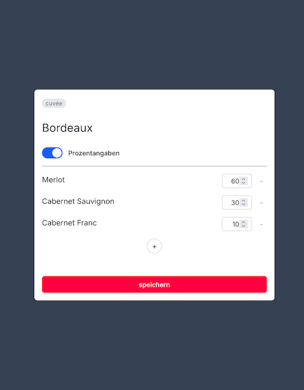

Der Vinolin-Grape-Selection-Component bietet die Möglichkeit, einen Wein, bestehend aus verschiedenen Rebsorten, zu 'erstellen'.



## Getting Started

First, run the development server:

```bash
npm run dev
# or
yarn dev
# or
pnpm dev
# or
bun dev
```

Open [http://localhost:3000](http://localhost:3000) with your browser to see the result.